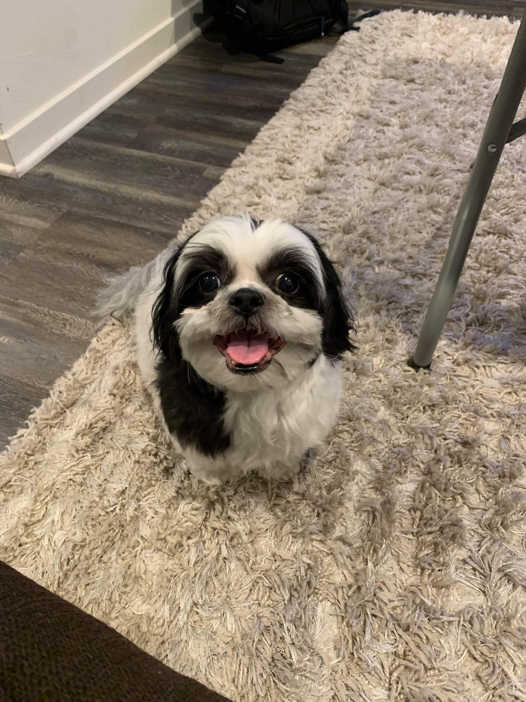

# **Hello! I'm Darryl and this is all about me...**


<br/>

[As A Person](#as-a-person)

[As A Programmer](#as-a-programmer)

<br/>

## **As A Person**

I'm a 3rd year Computer-Science major in Revelle College. Some things that I enjoy doing are:
- playing video-games
- hanging out with my friends
- chilling with my dog Yogi


<br/>

If Yogi was a class in Java, it would look something like this:
```java
public class Yogi {
    // Private variables
    private cute;
    private smart;
    private small;
    private lazy_and_spoiled;

    // Constructor
    public Yogi(){
        cute = true;
        smart = false;
        small = true;
        lazy_and_spoiled = true;
    }
}
```
Some more things that I enjoy:
- working out
- eating and sleeping
- ~~waiting till the very last minute to start on important assignments such as this lab~~ being a good student, turning things in on time, and maintaining an exceptional work ethic :D


<br/>

Some videogames that I enjoy playing are League of Legends (especially TFT), Minecraft, and Valorant. A fun fact about me: I reached Masters in TFT for 3 consecutive sets:
- [x] Set 4.5
- [x] Set 5
- [x] Set 5.5

Whenever I am feeling lazy or down, I always like to play [this motivational youtube video](https://www.youtube.com/watch?v=tYzMYcUty6s). It never fails to reinvigorate my spirits and get me back on track.

Some goals that I have for this Fall '21 quarter are:
1. Be more social
2. Get good grades
3. Be confident
4. Exercise and stay healthy

<br/>

## **As A Programmer**
My first year of college was the first time that I was exposed to anything programming related. The first class that I took at UCSD was CSE 8A where I learned an introduction to Python and Java. My favorite programming language as of now is Java because that's the langauge that I have spent the most time on. I always loved playing video games and glued my eyes to computers growing up. I became interested in how games were developed which led me to selecting Computer Science as my major! I hope to attain the skills to develop my own game while attending this university and maybe delve a little bit into front-end development as well.


